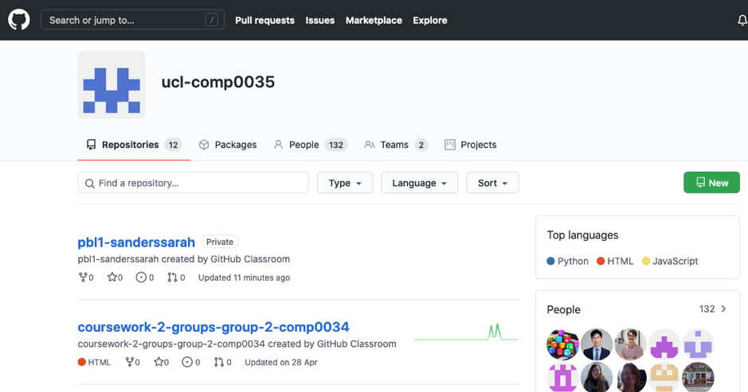

# Activity 4: Find a repository in GitHub

The first repository ('hello-world') you created is in your GitHub account.

The second repository ('practice') you created is in the ucl-comp0035 organisation.

While you own both of these, where you will find them is different.

## Find a repository in your GitHub account

If you are not already logged in then [login in to GitHub](https://github.com/login).

To find the 'hello-world' repository in your GitHub account:

1. Find the menu in the top right of the view by clicking on your profile image:

   

2. Select **Your repositories** from the drop-down.

   You should see the 'hello-world' repo you created in the first activity. You will not see the 'practice' repo that
   you created in the second activity.

## Find a repository in the ucl-comp0035 organisation
 
To find the 'practice' repository you created in the ucl-comp0035 organisation:

1. Find the menu in the top right of the view by clicking on your profile image:

   

2. Select **Your organizations** and then select the **ucl-comp0035** organisation.

   If you don’t see **Your organisations** then you may be a collaborator rather than a member of the ucl-comp0035
   organisation. If this is the case then go to <https://github.com/ucl-comp0035>, and you should see your repo listed.

   Another way to access the organisation is to click on the organisation icon in the bottom left of the screenshot
   shown above – hover on the icons and the name will display. You should then see the `practice` repository listed, and
   you can click on the link to access it:

   
