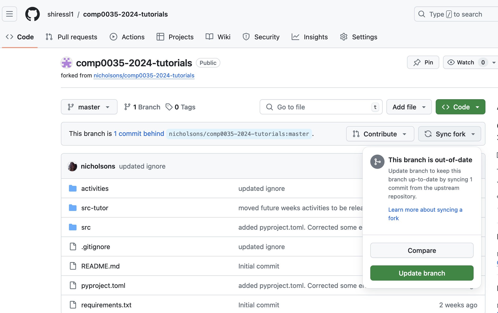

# COMP0035 Tutorial 2: Data preparation using Python pandas

## Pre-requisites

You should have completed week 1 activities and have a basic understanding of Python.

The activities assume that you have forked the COMP0035 tutorials repository, cloned it to your computer, and set up a
project with a virtual environment within your IDE (VS Code or PyCharm).

### 1. Update the forked tutorials repository

Login to GitHub and navigate to your forked copy of the COMP0035 tutorials repository.

Check whether any changes have been made. For example, the image below shows 1 new commit has been made to the original.


If changes have been made, you will need to update your forked repository.

Click on the "Synch fork" button; and then on "Update branch".


Now, open your IDE (VS Code, PyCharm) and update the local copy of the repository. This assumes you have integrated your
IDE with your GitHub account in week 1. You may be prompted to log in to GitHub before you can carry out the
following.

- In PyCharm try menu option Git > Pull
- In VS Code click on the source code control icon on the left side panel, then when the source code control pane opens,
  click on the three dots and select Pull.

There are other methods, look in the Help for either PyCharm or VSCode.

### 2. Check you have the virtual environment activated

Open a terminal window within your IDE in the project directory.

Check that your virtual environment is activated. There are various ways to do this, IDEs vary, usually a quick visual
way is to check whether the prompt starts with `(.venv)` or the name if your venv folder if not `.venv`. You can also
use Python in the Terminal:

```python
import os

print(os.environ.get('VIRTUAL_ENV'))
```

The following screenshot shows this in PyCharm on macOS:


If you are not in a venv, refer to [Week 1 activity 7](../week1/1-7-create-virtual-environment.md) for instructions.

### 3. Check you have the required libraries installed in the virtual environment

Open the Terminal in your IDE.

At the prompt, enter: `pip list`

This should print a list of installed Python packages and their versions. Check for `pandas`.

The default installation of pandas can only open Excel `.xlsx` files with an additional library called `openpyxl`. Check
if this is installed.

You can install these using `pip` e.g.  `pip install pandas openpyxl`

## Introduction

In this tutorial and the next you will use pandas to explore a dataset by understanding what it contains.

You will try also identify any problems with the data that need to be addressed ('cleaned'); and consider whether the
data is sufficient for your project.

You will write code in a way that is potentially reusable in an application, with considerations such as:

- creating a relevant Python module
- using relative filepaths to access data files
- creating Python functions, rather than a simple sequence of commands (procedural)

Writing code in this way may seem unnecessary at this stage, however you will be expected to do this for the coursework
so it is a good practice to start out working that way.

## Complete the activities

Tutorial activities can be found in the activities/week2 folder. These are:

1. [Create a package and module](2-1-python-structure.md)
2. [Open .csv and .xlsx files and create a DataFrame](2-2-pandas-open.md)
3. [Describe the dataframe](2-3-pandas-describe.md)
4. [Change data types](2-4-pandas-datatypes.md)
5. [Combine dataframes](2-5-pandas-joining-dataframes.md)
6. [Remove columns](2-6-pandas-removing-columns.md)
7. [Deal with missing values](2-7-pandas-missing-values)
8. [Columns with categorical values](2-8-pandas-categorical-data.md)
9. [Add new column](2-9-pandas-new-column.md)
10. [Save prepared data to .csv](2-10-save-df-to-file.md)
11. [Suggestions for further practice](2-11-further-practice)

Note: The activities in week 2 and week 3 are not evenly balanced, with less in week 3. If you do not finish in the week
tutorial time, you may want to continue these next week.

## Apply the knowledge to your coursework project

As a third year module, the coursework is not meant to be a series of instructions to follow. However, to get you
started this week here are some suggestions of what to do:

- Install pandas and openpyxl in the virtual environment of your courswork project in your IDE.
- Use pandas to read the data into a dataframe.
- Write code to describe the dataframe contents e.g. size, column names, datatypes, statistics.
- Write code to prepare the dataframe contents for your project e.g. consider missing values, unique values in columns,
  data types etc

Do some extra research. There are many tutorials publicly available that focus on data preparation with pandas. Try to
find examples that do more that has been covered in this tutorial to expand your knowledge.

