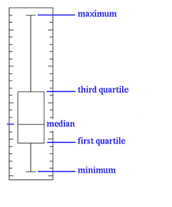

# Identifying outliers

An outlier is a data point that significantly differs from the other observations in a dataset. It lies outside the
overall pattern of distribution and can be unusually high or low compared to the rest of the data. Outliers can result
from variability in the data, measurement errors, or experimental errors.

You can identify outliers using different techniques:

- Plot the data (e.g., histogram, scatter plot, boxplot)
- Use common sense
- Use statistical tests

In statistical terms, outliers are often defined as values that fall below the first quartile (Q1) minus 1.5 times the
interquartile range (IQR) or above the third quartile (Q3) plus 1.5 times the IQR. Mathematically, this can be expressed
as:

```text
Lower Bound = Q1 − 1.5 × IQR
Upper Bound = Q3 + 1.5 × IQR
```

Where:

- (Q1) is the first quartile (25th percentile)
- (Q3) is the third quartile (75th percentile)
- (IQR) is the interquartile range, calculated as (Q3 - Q1)

Values outside these bounds are considered outliers.

Since this course doesn't expect any knowledge of, nor teach, statistics then we will check for outliers by creating a
chart or 'plot'.

In this activity, you will
create [pandas boxplots](https://pandas.pydata.org/pandas-docs/stable/reference/api/pandas.plotting.boxplot.html).

"A Box and Whisker Plot (or Box Plot) is a convenient way of visually displaying the data distribution through their
quartiles.

The lines extending parallel from the boxes are known as the 'whiskers', which are used to indicate variability outside
the upper and lower quartiles. Outliers are sometimes plotted as individual dots that are in-line with whiskers. Box
Plots can be drawn either vertically or
horizontally." [Source: Data Visualisation Catalogue](https://datavizcatalogue.com/methods/box_plot.html)

Box plots have a box from lower quartile to the upper quartile, with the median marked. 25% of the population is below
first quartile, 75% of the population is below third quartile.



Source: [statinfer](https://statinfer.com/104-3-5-box-plots-and-outlier-dectection-using-python/)

Box plots can help to get an idea of the data distribution which in turn helps us to identify the outliers more
easily.

If the box is pushed to one side, and some values are far away from the box, then it is an indication of outliers.

The following code shows a basic example of creating a boxplot with pandas and rendering the chart using matplotlib.
Numpy is only used in this example to generate the random numbers.

```python
import pandas as pd
import numpy as np
import matplotlib.pyplot as plt

df = pd.DataFrame(np.random.rand(10, 5), columns=["A", "B", "C", "D", "E"])
df.boxplot()
df.plot.box()  # This syntax is also valid
plt.show()
```

1. Add code to generate a box plot for the paralympics prepared data dataframe. Try to create this as a function as you
   did with the histogram.

   Notice that it plots all the variables on the same scale. Since the numbers are significantly smaller for duration
   than the numbers for participants, the result is that we can't see the duration boxplot clearly.
2. To see each variable in its own subplot try adding the argument `subplots=True` in the
   `boxplot(subplots=True, sharey=False)`
   method.
3. If you want to save the generated plot to an image file (you might wish to for the coursework, though not essential)
   try: `plt.savefig('bp_example.png')`

You should see an outlier in the duration. On examining the data you would find that this is because that year the
Paralympics were in two locations, New York and Stoke Mandeville, and held on two different dates so the start and end
span both events.

You could choose to:

- ignore the data
- try to find the data to allow you to split this into two entries
- remove the data
- compute the data

For now, ignore the data i.e. do nothing.

[Next activity](3-4-timeseries.md)