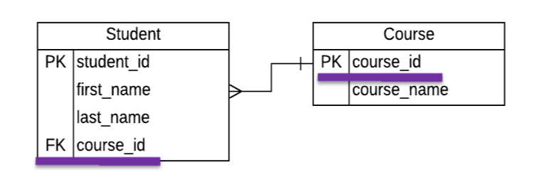
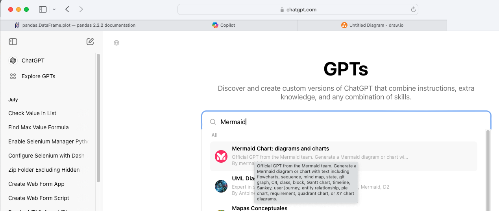
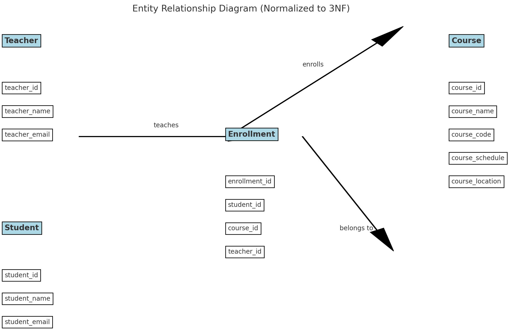

# 1. Introduction to database design and the entity relationship diagram (ERD)

This is a brief recap of the lecture material.

## Relational database

A **relational database** is a method of structuring data as **tables** associated to each other by shared attributes:

- a table row corresponds to a unit of data called a record
- a column corresponds to an attribute (or field) of that record


Relational databases typically use **Structured Query Language SQL)** to define, manage, and search data.

### Relational database design

**Database design** is the organization of data according to a database model. The designer determines what data must be
stored and how the data elements interrelate.

Connolly & Begg suggest three stages of database design. The are summarised as:

1. **Conceptual database design**: the conceptual representation of the database, including identifying the important
   entities, relationships and attributes
2. **Logical database design**: use normalization techniques to translate the conceptual representation to the logical
   structure of the database
3. **Physical database design**: decide how the logical structure is to be physically implemented in the target database
   management system


## Normalisation

**Normalisation** is the process of structuring data into tables in a way that avoids update anomalies; and reduces data
redundancy and the resulting data storage.

Update anomalies can occur when the same value is in multiple tables and needs to be updated or deleted in both; issues
can occur if not all occurrences are identified and updated.

The process of normalisation divides larger tables into smaller tables and links them using relationships between key
attributes.

- **Primary key (PK)**: a column (or combination of columns) guaranteed to be unique for each record and cannot be NULL
- **Foreign key (FK)**: a column in table A storing a primary key value from table B



<p style="text-align: center; font-style: italic">A course is taken by many students, each student is enrolled on only one course<p>

There are different levels of normalisation. It is not always desired, or necessary, to achieve 6th normal form, for the
purposes of this course (and many applications) 3rd normal form is typically sufficient

This course focuses on the general principles of normalization rather than the formal relational theory (refer to either
of the database textbooks in the reading list if you wish to understand this topic in more detail)

You are typically looking to revise your database design such that:

- Each column/row intersection has only one entry
- Each row and column in a table is unique
- Each table has a primary key (a unique identifier)
- Tables with relationships are linked by primary/foreign key relationships
- If you delete a record you don’t also lose a value that may still be needed
- Where there is a many-to-many relationship you will need to add a new table between the two tables so forming two
  one-to-many relationships.

### Entity Relationship Diagram (ERD)

An **ERD** is a structural diagram used in database design. An ERD is a visual representation of the relationships
between entities in a database. It's an important tool in database design and helps to illustrate how data is
interconnected.

ERDs are used to plan and design databases, ensuring that the structure is logical and efficient. They help database
designers and developers understand the data requirements and relationships.

It contains different symbols and connectors that represent:

- **Entities**: These are objects or concepts that can have data stored about them. For example, in a university
  database, entities might include Student, Course, and Professor.
- **Attributes**: These are the details or properties of an entity. For instance, a Student entity might have attributes
  like StudentID, Name, and DateOfBirth.
- **Relationships**: These show how entities are related to each other. For example, a Student might enroll in a Course,
  or a Professor might teach a Course.
- **Cardinality**: This indicates the number of instances of one entity that can be associated with instances of another
  entity. Common cardinalities include one-to-one, one-to-many, and many-to-many.

An example:


As the ERD is refined, further detail can be added to it. The ERD diagram can be used at different stages of the
database design process.

The following diagram illustrates entities and attributes at different levels of detail:


The relationships between entities can be represented with Crow’s Foot notation, or other notations such as Chen’s
notation.


Entity relationships may be one-to-one, one-to-many, many-to-many, these are shown as:


Relational databases do not typically implement many-to-many relationships. During the process of normalisation:

- one-to-one: Tables are associated through the primary key in each table
- one-to-many: The primary key attribute in the one must be listed as an additional attribute (foreign key) in the many.
  The tables are associated by the similar attributes.
- many-to-many: A new table is always created and the primary key attributes of the original tables are made attributes
  of the new table. These are often combined to form a composite primary key – or a new surrogate primary key is
  created.

## ERD tools

At the time of writing the following were free online tools to use but may require you to create an account.

- [draw.io](https://app.diagrams.net)
- [Visual Paradigm online](https://online.visual-paradigm.com/diagrams/templates/entity-relationship-diagram/)
- [Diagrams.net](https://app.diagrams.net/)
- [LucidChart](https://lucid.app/pricing/lucidchart?anonId=0.87353863184e1c9485e&sessionDate=2022-12-05T10%3A16%3A15.712Z&sessionId=0.c6a8888f184e1c9485f&referer=https%3A%2F%2Fwww.lucidchart.com%2Fpages%2F#/createAccount)
  Free account is now limited to 3 diagrams; there is an ERD crow's foot template available.

There are also coding tools, such
as [Mermaid](https://mermaid.js.org/intro/getting-started.html#_3-using-mermaid-plugins) (plugins for PyCharm and VS
Code) that can be used to generate diagrams.

Further, chatGPT and CoPilot can give suggestions and draw diagrams based on an uploaded data file.

In [copilot](https://copilot.microsoft.com) try entering the prompt `Draw an ERD for the data in the attached csv file`
and attach the `src/tutorialpkg/data_db_activity/student_data.csv` file to it.

Note that the diagram format below given by copilot _is not_ good enough for the coursework!

```text
+---------------+        +-------------+        +-----------------+
|  Teacher      |        |  Student    |        |  Course         |
+---------------+        +-------------+        +-----------------+
| teacher_id    |<------>|student_id   |<------>| course_id       |
| teacher_name  |        |student_name |        | course_name     |
| teacher_email |        |student_email|        | course_code     | 
+---------------+        +-------------+        | course_schedule |
                                                | course_location |
                                                +-----------------+

+---------------+        +--------------+        +----------------+
|  Teacher      |        |  Student     |        |  Course        |
+---------------+        +--------------+        +----------------+
| teacher_id    |<------>|student_id    |<------>| course_id      |
| teacher_name  |        |student_name  |        | course_name    |
| teacher_email |        |student_email |        | course_code    |
+---------------+        +--------------+        | course_schedule|
                                                 | course_location|
                                                 +----------------+
```

In chatGPT try going to 'Explore GPTs' and then search for Mermaid which is a diagramming tool (or Lucid). The free
level of chatGPT only allows you a few prompts per day so if you've already used them for today then you won't be able
to do this:



In the Mermaid or Lucid GPT try `Draw an entity relationship diagram that is normalised to 3NF for the attached data`

On previous occasions this has returned the mermaid syntax for the ERD as well as a well formatted ERD. However on this
occasion the diagram is again not suitable for the coursework.



This gave the following response:

The provided data contains the following columns:

- record_id: A unique identifier for each record.
- teacher_name: The name of the teacher.
- teacher_email: The teacher's email.
- student_name: The name of the student.
- student_email: The student's email.
- course_name: The name of the course.
- course_code: The unique code for the course.
- course_schedule: The schedule of the course (days and time).
- course_location: The location where the course is held.

Analysis for Normalization:

- 1NF (First Normal Form): The data is in 1NF since all columns contain atomic values (no repeating groups or
  multivalued attributes).
- 2NF (Second Normal Form): To achieve 2NF, the table must first be in 1NF, and all non-key attributes should depend on
  the entire primary key. The current data appears to have a partial dependency (e.g., student details depending only on
  student name, teacher details on teacher name, etc.).
- 3NF (Third Normal Form): To achieve 3NF, the table must be in 2NF, and there should be no transitive dependency (i.e.,
  no non-key attribute should depend on another non-key attribute).

Normalization Approach:

Entities:

- Teacher: teacher_id, teacher_name, teacher_email
- Student: student_id, student_name, student_email
- Course: course_id, course_name, course_code, course_schedule, course_location
- Enrollment: This links students to courses and teachers. enrollment_id, student_id, course_id, teacher_id

Let me now draw an ER diagram based on this normalized structure.

Here is the Entity Relationship (ER) Diagram, normalized to Third Normal Form (3NF). It includes four entities:

- Teacher: Attributes are teacher_id, teacher_name, and teacher_email.
- Student: Attributes are student_id, student_name, and student_email.
- Course: Attributes are course_id, course_name, course_code, course_schedule, and course_location.
- Enrollment: This serves as the relationship table linking students to courses and teachers. It includes enrollment_id,
  student_id, course_id, and teacher_id.

- Each entity contains only the relevant attributes, eliminating redundancies. The relationships between students,
  teachers, and courses are managed through the Enrollment entity.

[Next activity](4-2-ERD.md)