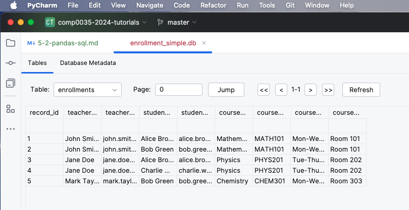

# Using pandas functions to create an un-normalised database

In this activity you will use pandas to create a database.

## Data

The next two activities use the `student_data.csv` file to create a SQLite database.

## 1. Use pandas and sqlite3 to create a single table un-normalised database

Create yourself a new module (or a package and a module) for the database activities.

In this first step, create a database that exactly matches the table in the dataframe. This is NOT normalised and has
the following columns:

`record_id,teacher_name,teacher_email,student_name,student_email,course_name,course_code,course_schedule,course_location`

1. Create a function that will create an un-normalised table from a dataframe and save it to a database. Inside the
   function:

    - Create a connection to the database using sqlite3
    - Use the pandas dataframe.to_sql to save the dataframe to a table called 'enrollments'
    - Close the connection

      ```python
      # Create a connection to the database using sqlite3.
      conn = sqlite3.connect(db_path)

      # Save the dataframe to the database, this will create a table called 'enrollments' and replace it if
      # it exists. The index column is not saved to the table.
      # If the file does not exist then it will be created.
      df.to_sql('enrollments', conn, if_exists='replace', index=False)

      # Close the connection.
      conn.close()
      ```

2. In main:

    - add code to read the data file [student_data.csv](../../src/tutorialpkg/data_db_activity/student_data.csv) into a
      DataFrame.
    - Add code to create a filepath to a file `src/tutorialpkg/data_db_activities/enrollments_unnormalised.db`. You can
      use any file
      extension for an SQLite database, by convention `.db` or `.sqlite` are used.
    - Call the function and pass the data file and db to it.

3. Run the code. You should see a new file in the directory
   `src/tutorialpkg/data_db_activities/enrollments_unnormalised.db`. Click on the file to open it. For VS Code this
   assumes you added the extensions as noted in [the setup instructions](5-0-instructions.md), for PyCharm Professional
   it should open.




## Primary key no defined

A key point to note is that this does not add data constraints, including primary key fields, to the database. It just
adds the data. You could still use the database if you take care to add new rows with an incremental `record_id`.

The next activity introduces the use of SQL which can be used to alter the table to define the primary key field.

[Next activity](5-3-studentdb-normalised-structure.md)